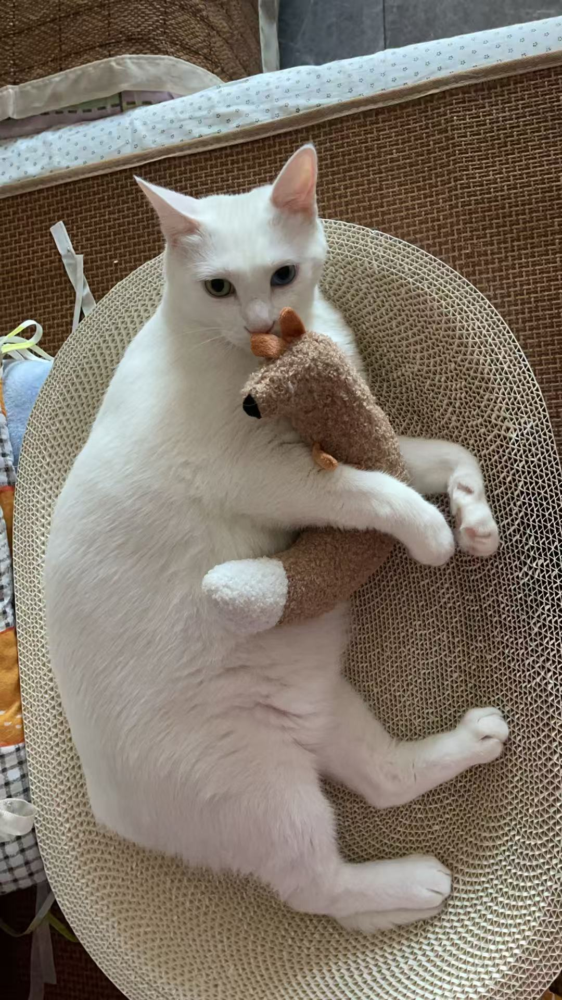
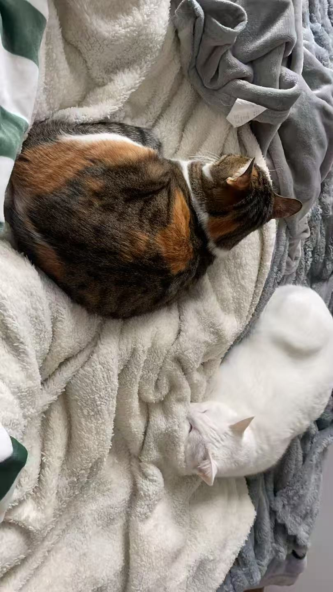
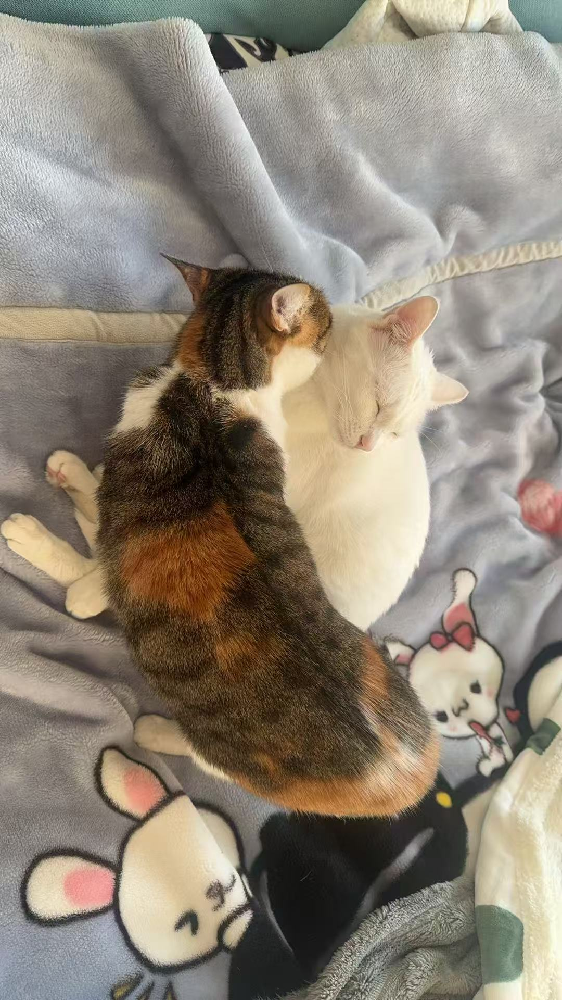
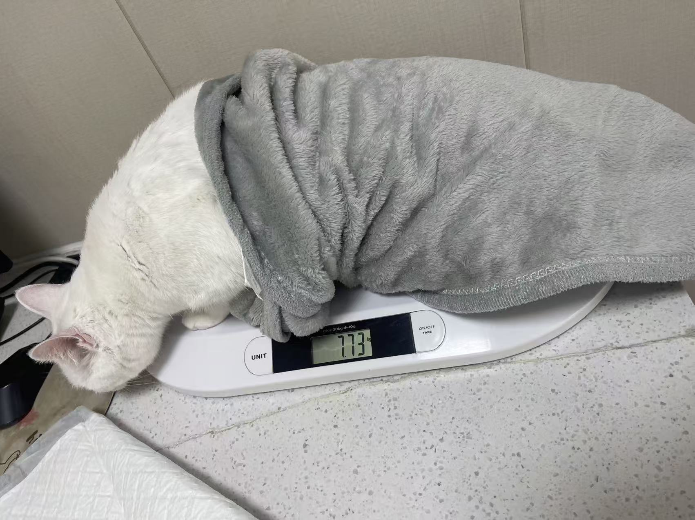
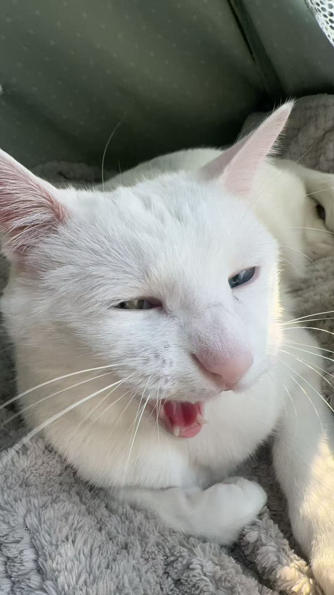
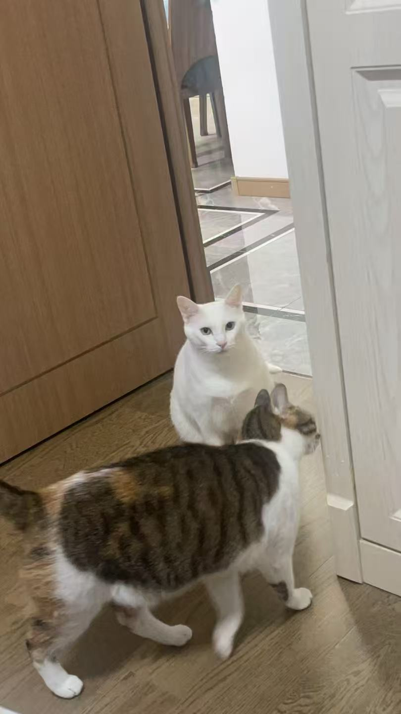

 

 

 

*Building in public across [career-ops](https://github.com/career-ops-hq/career-ops), [Plot-Ark](https://github.com/Schlaflied/Plot-Ark), and [Hive](https://github.com/aden-hive/hive).*

---

### 🐱 Office cat gallery (unpaid, unbothered, occasionally on the keyboard)

**Icy (冰糖)** — odd-eyed white cat, 3 years old · **Xueli (雪梨)** — calico, 1.5 years old

click to expand — 33 appearances by the chief distraction officers

<!-- CAT-GALLERY:START -->

<!-- CAT-GALLERY:END -->

---

## Hi, I'm Schlaflied

I'm an instructional designer who builds learning systems, automation, and the infrastructure around them. My background is in education and HR; most of my current work sits where learning analytics, agent workflows, and open source meet.

SCORM can tell you whether someone finished a module. I'm more interested in what happened along the way, so I keep building tools around xAPI, behavioral traces, and feedback loops.

**Currently shipping:**
- 🎯 [Plot-Ark](https://github.com/Schlaflied/Plot-Ark) — an xAPI learning-analytics platform with at-risk detection, an A2A agent pipeline, and automated reports for instructional designers.
- 🧠 [Cogito](https://github.com/Schlaflied/Cogito) — an experiment in mapping patterns from git history and notes: behavioral traces at a personal scale.
- 🔌 Five local-first [career-ops plugins](https://github.com/career-ops-hq/career-ops): [Google Calendar](https://github.com/Schlaflied/career-ops-plugin-google-calendar), [LinkedIn alerts](https://github.com/Schlaflied/career-ops-plugin-linkedin-alerts), [Outlook interviews](https://github.com/Schlaflied/career-ops-plugin-outlook-interviews), [Tavily](https://github.com/Schlaflied/career-ops-plugin-tavily), and [Obsidian](https://github.com/Schlaflied/career-ops-plugin-obsidian).
- ⚔️ **Core Contributor** at [career-ops](https://github.com/career-ops-hq/career-ops) (70K+ ★), and a member of its `maintainers` and `triagers` teams. I have **87 merged PRs** across ATS providers, data integrity, interview workflows, and jurisdiction-aware checks. Highlights include the SQLite index ([#918](https://github.com/career-ops-hq/career-ops/issues/918) → [#919](https://github.com/career-ops-hq/career-ops/pull/919)), the per-plugin registry design ([#1402](https://github.com/career-ops-hq/career-ops/pull/1402)), and recent Gem and Collage providers ([#3785](https://github.com/career-ops-hq/career-ops/pull/3785), [#3787](https://github.com/career-ops-hq/career-ops/pull/3787)).
- 🛡️ [ClearCover](https://github.com/Schlaflied/clearcover) — a local-first insurance policy reader that places plain-language explanations beside the original clauses. Chinese and English, translation only, never advice.
- 📐 [Shared Behavioral-Signal Layer](https://github.com/career-ops-hq/career-ops/issues/1506) — an open RFC for pooling company-attributable, candidate-anonymous interview-process signals.
- 🤝 Contributor to [Hive](https://github.com/aden-hive/hive) — the [SDR Agent template](https://github.com/aden-hive/hive/pull/5178) was merged in v0.7.3; follow-up agent templates are in review.

all 87 merged career-ops PRs, grouped

**Jurisdiction compliance & posting-legitimacy signals (17)**
- [#1631](https://github.com/career-ops-hq/career-ops/pull/1631) — employee-vs-contractor classification warning signal
- [#1685](https://github.com/career-ops-hq/career-ops/pull/1685) — flag JDs where AI/transformation buzzwords don't match company infrastructure
- [#1748](https://github.com/career-ops-hq/career-ops/pull/1748) — user-owned company blacklist respected by scan and evaluation
- [#1856](https://github.com/career-ops-hq/career-ops/pull/1856) — interview-redflag → suggest a blacklist entry at the Reconsider tier
- [#1936](https://github.com/career-ops-hq/career-ops/pull/1936) — Block G signal: benefits/employment terminology country mismatch
- [#1938](https://github.com/career-ops-hq/career-ops/pull/1938) — Block G signal: third-party platform location tag mismatch
- [#2014](https://github.com/career-ops-hq/career-ops/pull/2014) — rejection-latency signal: statutory/courtesy post-interview response-time thresholds (suggestion-only)
- [#2020](https://github.com/career-ops-hq/career-ops/pull/2020) — Block G signal: jurisdiction-prohibited posting content
- [#2021](https://github.com/career-ops-hq/career-ops/pull/2021) — pay-transparency disclosure signal: jurisdiction range-width cap + missing-range corroborating signal
- [#2027](https://github.com/career-ops-hq/career-ops/pull/2027) — minimum-wage floor check: jurisdiction table + date-aware wage-floor signal
- [#2029](https://github.com/career-ops-hq/career-ops/pull/2029) — offer-prep jurisdiction-aware restrictive-covenant notes + lawyer questions
- [#2031](https://github.com/career-ops-hq/career-ops/pull/2031) — interview-redflag: protected-grounds question detection from a jurisdiction table
- [#2034](https://github.com/career-ops-hq/career-ops/pull/2034) — Block G signal: immigration-status requirement overreach
- [#2038](https://github.com/career-ops-hq/career-ops/pull/2038) — `check-table-freshness.mjs`: staleness validator for jurisdiction-keyed tables
- [#2041](https://github.com/career-ops-hq/career-ops/pull/2041) — agency/recruiter licensing check — jurisdiction table + registry pointer
- [#2042](https://github.com/career-ops-hq/career-ops/pull/2042) — offer-prep sub-statutory terms check: jurisdiction floors table + statutory-context notes + lawyer questions
- [#2896](https://github.com/career-ops-hq/career-ops/pull/2896) — Block G signal 15: AI-screening disclosure (verified jurisdiction seeds w/ effective dates, e.g. NYC Local Law 144)

**Interview prep, debrief & scheduling (15)**
- [#1233](https://github.com/career-ops-hq/career-ops/pull/1233) — post-interview company red-flag detector from transcript signal
- [#1497](https://github.com/career-ops-hq/career-ops/pull/1497) — fuzzy-match interview-invite emails to tracker entries
- [#1502](https://github.com/career-ops-hq/career-ops/pull/1502) — structured Panel Intel table for named panelists in panel-mixed rounds
- [#1858](https://github.com/career-ops-hq/career-ops/pull/1858) — wire Panel Intel table into interview/plan when later-round panelists are named
- [#1860](https://github.com/career-ops-hq/career-ops/pull/1860) — confirmed-time no-show follow-up email scenario
- [#1941](https://github.com/career-ops-hq/career-ops/pull/1941) — cross-reference coffee chat notes against interview transcripts
- [#1943](https://github.com/career-ops-hq/career-ops/pull/1943) — flag scope/compensation mismatch when interview probes off-JD skills at entry-level pay
- [#2097](https://github.com/career-ops-hq/career-ops/pull/2097) — wire interview-prep's sourced-question research into `interview/plan`
- [#2100](https://github.com/career-ops-hq/career-ops/pull/2100) — invite-match: recognize rejection emails, not just interview invites
- [#2676](https://github.com/career-ops-hq/career-ops/pull/2676) — invite-match: distinguish AI-interviewer platforms (Alex, HireVue) from human calls
- [#2122](https://github.com/career-ops-hq/career-ops/pull/2122) — `interview/debrief`: support debriefing directly from an existing transcript
- [#2124](https://github.com/career-ops-hq/career-ops/pull/2124) — wire followup-cadence's cold classification into `stats.mjs`'s `activeApps`
- [#2127](https://github.com/career-ops-hq/career-ops/pull/2127) — `interview/debrief`: correct contradicted facts in the prep file in place
- [#2128](https://github.com/career-ops-hq/career-ops/pull/2128) — interview-prep: detect call platform (phone/Zoom/Teams/Meet) from invite text
- [#2130](https://github.com/career-ops-hq/career-ops/pull/2130) — weekly interview digest aggregator

**Application pipeline & tracker integrity (15)**
- [#919](https://github.com/career-ops-hq/career-ops/pull/919) — SQLite derived index over `applications.md` (RFC #918 phase 1)
- [#961](https://github.com/career-ops-hq/career-ops/pull/961) — transcript-driven targeting correction
- [#1467](https://github.com/career-ops-hq/career-ops/pull/1467) — recruiting-process friction signal
- [#1525](https://github.com/career-ops-hq/career-ops/pull/1525) — merge-tracker req/job-number guard on tier-3 fuzzy dedup
- [#1557](https://github.com/career-ops-hq/career-ops/pull/1557) — candidate contact-channel preference field for outreach/email drafts
- [#1687](https://github.com/career-ops-hq/career-ops/pull/1687) — skills-assessment event log with candidate-observed staleness signal (`assessment-log.mjs`)
- [#1703](https://github.com/career-ops-hq/career-ops/pull/1703) — `fix-slugs.mjs`: auto-write ATS slug corrections back to `portals.yml`
- [#1738](https://github.com/career-ops-hq/career-ops/pull/1738) — unified Risk Summary block joining the five company-risk signals
- [#1745](https://github.com/career-ops-hq/career-ops/pull/1745) — ATS-broken fallback email — recover a stuck application when the pipeline machinery jams
- [#1803](https://github.com/career-ops-hq/career-ops/pull/1803) — `paste-reply.mjs`: manual/no-Gmail input path into the reply-watch classification pipeline
- [#1817](https://github.com/career-ops-hq/career-ops/pull/1817) — interview-prep URL entry path for a role that was never evaluated
- [#1853](https://github.com/career-ops-hq/career-ops/pull/1853) — track compensation stated per interview round (`salary-gap.mjs`)
- [#2652](https://github.com/career-ops-hq/career-ops/pull/2652) — process-quality: documented example friction patterns for the `[process-friction]` tag
- [#2672](https://github.com/career-ops-hq/career-ops/pull/2672) — reply-matcher: require corroboration for partial role-title matches (fixes cross-application false-positive misattribution)
- [#2788](https://github.com/career-ops-hq/career-ops/pull/2788) — `company-history.mjs`: opt-in no-response-friction signal emission, first producer of the RFC #1506 shared-signal schema

**CLI robustness & test hardening (9)**
- [#1503](https://github.com/career-ops-hq/career-ops/pull/1503) — `toBashPath()` cygpath-before-wslpath fix (WSL/Cygwin)
- [#1505](https://github.com/career-ops-hq/career-ops/pull/1505) — `tracker-sync-check.mjs`: applications.md ↔ active-interviews.md status sync checker
- [#1635](https://github.com/career-ops-hq/career-ops/pull/1635) — reject unrecognized CLI flags instead of silently ignoring them
- [#1705](https://github.com/career-ops-hq/career-ops/pull/1705) — detect and prevent duplicate tracker # numbers (data-integrity hardening)
- [#1772](https://github.com/career-ops-hq/career-ops/pull/1772) — normalize CRLF at read time for doc assertions in `test-all.mjs`
- [#1800](https://github.com/career-ops-hq/career-ops/pull/1800) — recognize "—" as a valid score-cell sentinel
- [#2745](https://github.com/career-ops-hq/career-ops/pull/2745) — reply-watch: reject unrecognized CLI flags instead of treating them as a candidates path
- [#2746](https://github.com/career-ops-hq/career-ops/pull/2746) — dedup-tracker: reject unrecognized flags instead of silently live-running
- [#2778](https://github.com/career-ops-hq/career-ops/pull/2778) — `lib/cli-flags.mjs`: shared flag-validation helper (`validateFlags`), migrated 3 scripts + `scan.mjs`'s own `--help`-triggers-a-live-scan fix

**ATS discovery & scanning (9)**
- [#746](https://github.com/career-ops-hq/career-ops/pull/746) — reverse-ATS job discovery (`scan-ats-full.mjs`)
- [#1248](https://github.com/career-ops-hq/career-ops/pull/1248) — ATS auto-fill for Greenhouse / Ashby / Lever (prepare, don't submit)
- [#1405](https://github.com/career-ops-hq/career-ops/pull/1405) — ATS channel yield analysis (algorithmic-monoculture aware)
- [#1638](https://github.com/career-ops-hq/career-ops/pull/1638) — scope `content_filter` per title-category via `by_title_keyword`
- [#1847](https://github.com/career-ops-hq/career-ops/pull/1847) — add `scan-ats-full.mjs` to AGENTS.md Main Files table
- [#1848](https://github.com/career-ops-hq/career-ops/pull/1848) — wire `content_filter` (incl. `by_title_keyword` scoping) into reverse ATS scans
- [#1872](https://github.com/career-ops-hq/career-ops/pull/1872) — surface post-submission resume verification for SuccessFactors-family ATS
- [#1921](https://github.com/career-ops-hq/career-ops/pull/1921) — warn candidate to check employer ATS profile before reapplying to a repeat company
- [#2095](https://github.com/career-ops-hq/career-ops/pull/2095) — reverse-ATS country-eligibility filter: US-only vs. US+Canada remote postings from JD body text

**CV, matching & targeting (9)**
- [#1230](https://github.com/career-ops-hq/career-ops/pull/1230) — zero-LLM STAR story matcher from `story-bank.md`
- [#1259](https://github.com/career-ops-hq/career-ops/pull/1259) — match-star fixtures + keyword-scorer assertions
- [#1559](https://github.com/career-ops-hq/career-ops/pull/1559) — JD skill-gap checker: classify JD-required skills before CV generation, zero-LLM
- [#1647](https://github.com/career-ops-hq/career-ops/pull/1647) — `--allow-reorder` flag for intentional CV section reordering
- [#1731](https://github.com/career-ops-hq/career-ops/pull/1731) — convert a screenshot into a PDF for ATS uploads (`img-to-pdf.mjs`)
- [#2950](https://github.com/career-ops-hq/career-ops/pull/2950) — `negotiation-roi.mjs`: ROI-based salary-negotiation talking-point generator from story-bank proof points
- [#2948](https://github.com/career-ops-hq/career-ops/pull/2948) — `story-provenance-check.mjs`: tier the Source-of-Truth boundary so `story-bank.md` can't silently inherit `cv.md`'s trust level
- [#3554](https://github.com/career-ops-hq/career-ops/pull/3554) — CJK support for the LaTeX/Overleaf CV path via tectonic
- [#3642](https://github.com/career-ops-hq/career-ops/pull/3642) — fix `validateCvSectionOrder` to accept the canonical `modes/pdf.md` tailoring order

**Plugins & core architecture (4)**
- [#1347](https://github.com/career-ops-hq/career-ops/pull/1347) — google-calendar plugin v0.1.0
- [#1348](https://github.com/career-ops-hq/career-ops/pull/1348) — tavily plugin v0.1.0
- [#1399](https://github.com/career-ops-hq/career-ops/pull/1399) — obsidian plugin v0.1.0
- [#1402](https://github.com/career-ops-hq/career-ops/pull/1402) — per-plugin registry files: conflict-free community registry PRs

**Recent providers & reliability work (9)**
- [#2791](https://github.com/career-ops-hq/career-ops/pull/2791) — require every evaluation report to retain an archived JD
- [#3643](https://github.com/career-ops-hq/career-ops/pull/3643) — stop treating ordinary prose as a tool claim
- [#3699](https://github.com/career-ops-hq/career-ops/pull/3699) — make the CV template's second hard-coded color themeable
- [#3710](https://github.com/career-ops-hq/career-ops/pull/3710) — per-company title-filter overrides for reverse ATS scans
- [#3785](https://github.com/career-ops-hq/career-ops/pull/3785) — Gem public REST job-board provider
- [#3787](https://github.com/career-ops-hq/career-ops/pull/3787) — Collage HR public job provider
- [#3837](https://github.com/career-ops-hq/career-ops/pull/3837) — reject login walls, error pages, paywalls, and JS shells as archived JDs
- [#3851](https://github.com/career-ops-hq/career-ops/pull/3851) — prioritize configured locations during Workday facet recovery
- [#3909](https://github.com/career-ops-hq/career-ops/pull/3909) — require a real word before treating text as a title claim

**How I build:**
I use AI throughout development, but the problem framing, system design, constraints, review, and accountability stay with me. I care less about who typed each line than whether the result is understandable, testable, and honest about its limits.

**Also on GitHub:**
- [`job-autopilot`](https://github.com/Schlaflied/job-autopilot) — a direct-outreach workflow for job searches
- [`hr-skill`](https://github.com/Schlaflied/hr-skill) — because HR deserves better questions
- [`roast-cold-email-skill`](https://github.com/Schlaflied/roast-cold-email-skill) — cold-email feedback with receipts, not empty compliments

If you're working on agentic AI, workflow automation, or learning systems—or hiring for that kind of work—the repositories above are the best place to start.

MPEd @ Western · EdTech · Discord: **schlaflied_**

---

## 你好，我是Schlaflied

教学设计出身，现在主要做学习系统、AI工作流和开源项目。我的背景横跨教育和HR，最近的工作基本都落在学习分析、agent workflow和开源协作的交叉点上。

SCORM能告诉你一个人有没有完成课程；我更想知道学习过程中到底发生了什么。所以我一直在折腾xAPI、行为数据和反馈回路。

**现在在做：**
- 🎯 [Plot-Ark](https://github.com/Schlaflied/Plot-Ark) — 用xAPI记录学习行为，结合A2A agent做风险识别和报告生成，给教学设计师用。
- 🧠 [Cogito](https://github.com/Schlaflied/Cogito) — 从git历史和笔记里整理行为痕迹，试着画出一个人实际如何思考和工作的地图。

**开源贡献：**
- [career-ops](https://github.com/career-ops-hq/career-ops)（70K+ ★）— Core Contributor，也是`maintainers`和`triagers`团队成员。目前有**87个已合并PR**，主要做ATS/provider、数据完整性、面试流程和地区规则检查。代表工作包括SQLite索引（[#918](https://github.com/career-ops-hq/career-ops/issues/918) → [#919](https://github.com/career-ops-hq/career-ops/pull/919)）、per-plugin registry设计（[#1402](https://github.com/career-ops-hq/career-ops/pull/1402)），以及最近的Gem和Collage provider（[#3785](https://github.com/career-ops-hq/career-ops/pull/3785)、[#3787](https://github.com/career-ops-hq/career-ops/pull/3787)）。
- [career-ops插件](https://github.com/career-ops-hq/career-ops) — 做了五个local-first插件：[Google Calendar](https://github.com/Schlaflied/career-ops-plugin-google-calendar)、[LinkedIn alerts](https://github.com/Schlaflied/career-ops-plugin-linkedin-alerts)、[Outlook interviews](https://github.com/Schlaflied/career-ops-plugin-outlook-interviews)、[Tavily](https://github.com/Schlaflied/career-ops-plugin-tavily)和[Obsidian](https://github.com/Schlaflied/career-ops-plugin-obsidian)。
- 🛡️ [ClearCover](https://github.com/Schlaflied/clearcover) — 本地优先的保险保单阅读器，把原始条款和人话解释放在一起。支持中英文，只做解释，不给建议。
- 📐 [Shared Behavioral-Signal Layer](https://github.com/career-ops-hq/career-ops/issues/1506) — 一个仍在讨论中的RFC，目标是汇总「公司可归因、候选人匿名」的面试流程信号。
- [Hive](https://github.com/aden-hive/hive) — [SDR Agent模板](https://github.com/aden-hive/hive/pull/5178)已合并进v0.7.3，后续agent模板还在review。

**我怎么做项目：**
我会先把问题边界、系统结构和agent行为写清楚，再借助AI实现；最后靠测试、review和公开PR把结果校验出来。不是假装每一行都由我手敲，也不是把判断全部交给模型。

**最新学术糟粕：**
- [当Claude成为我的老师：AI作为后现代青年精神权威的田野报告](https://shitspace.xyz/article/bea4cbe3-3ddb-457e-9af9-3b6ca4e41944)

欢迎来找我玩：Discord: **schlaflied_**
